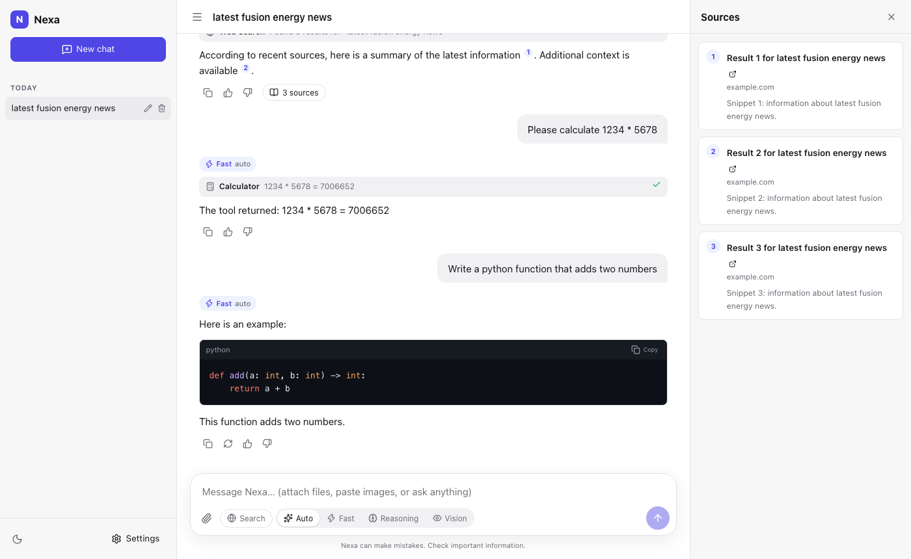
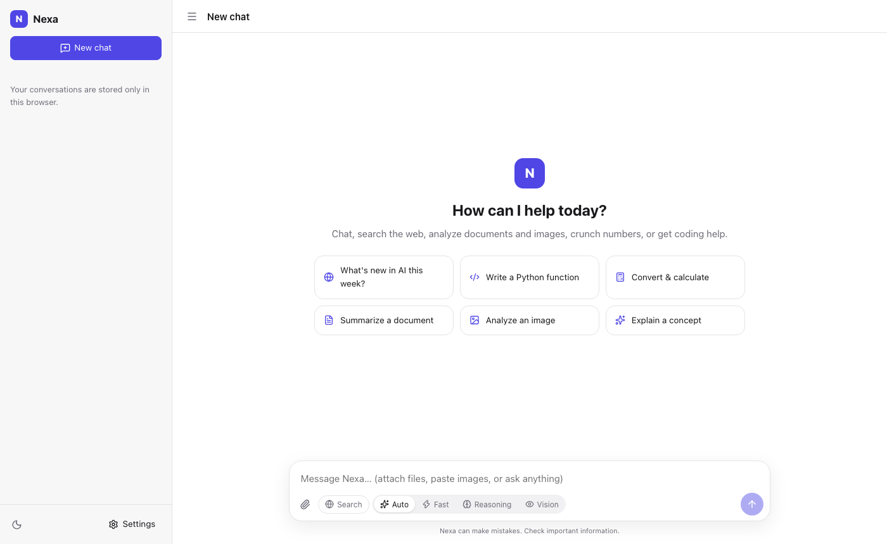
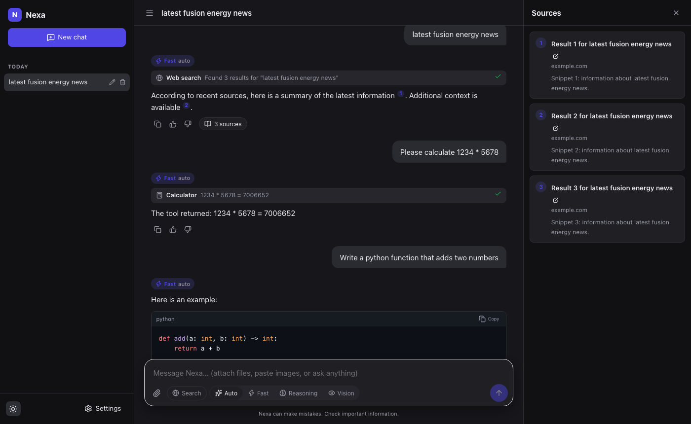
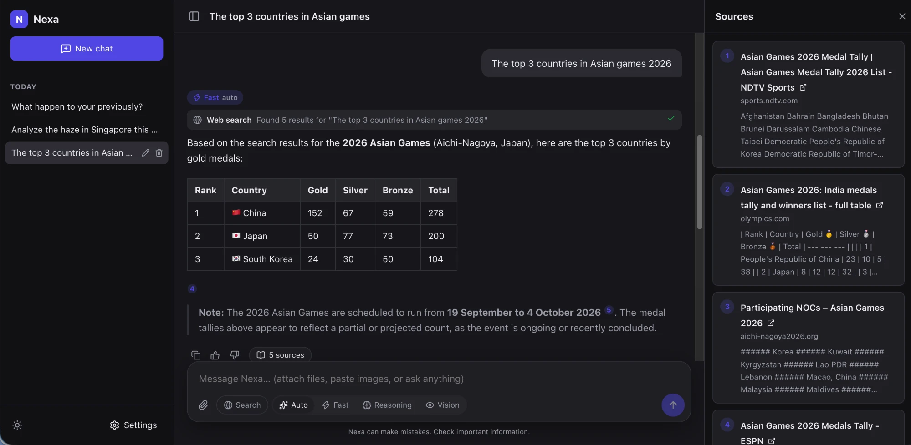
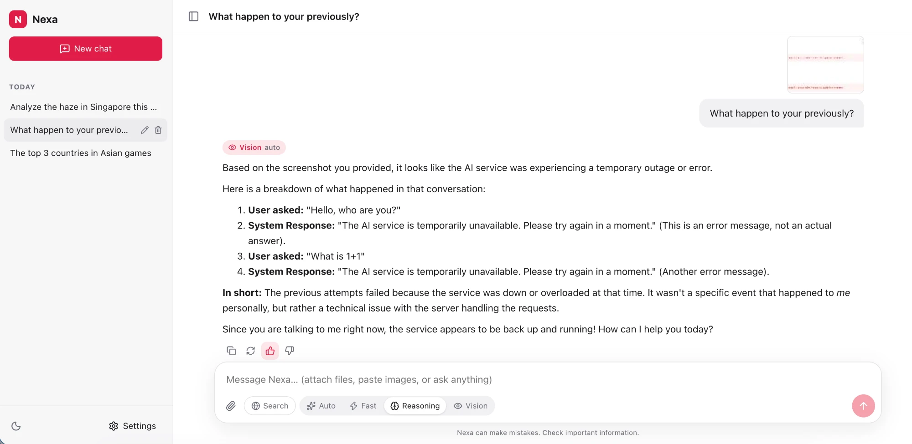
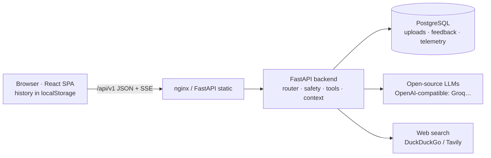

# Nexa — fast, anonymous, multimodal AI assistant

**Try it: <https://nexa-c8g1.onrender.com>** (no sign-up; the free hosting sleeps when idle, so
the first load can take ~1 min).



## The problem

General-purpose AI assistants usually require an account, keep your conversations on their
servers, hide which model answered, and are slow to show the first word. Many people just want
to ask a question, drop in a PDF or a photo, check today's news with sources, or get help with
code **right now**, without signing up.

## What Nexa does

Nexa is a web assistant you can use immediately — no registration — built on cloud-hosted
**open-source models** and optimised for **time to first token**. (Full spec:
[product-spec.md](product-spec.md).)

| You can… | How it behaves |
|---|---|
| Chat with streamed answers | Text appears token by token; **Stop** cancels instantly; **Regenerate** the latest answer; **edit** your latest message and get a new answer |
| Let Nexa pick the model, or choose | **Auto** routing picks *Fast*, *Reasoning* or *Vision* per message (the reason is shown); override with one click |
| Upload documents and images | PDF, DOCX, XLSX, text/Markdown/CSV/JSON/HTML and code files; PNG/JPEG/WebP/GIF. Summarise, ask questions, analyse several files independently; click an image to view it full size |
| Search the web | Toggle **Search**, or Nexa searches automatically for time-sensitive questions; answers cite sources as `[n]` with a **Sources panel** |
| Use built-in tools | Calculator, unit conversion, date/time & time zones, basic data processing (stats, sort, filter, group) — with live tool activity |
| Keep your history private | Conversations live **only in your browser**; rename/delete them; uploads are deleted from the server after 24 h |
| Make it yours | Light/dark/system theme, accent colour, text size, density, width, tool-activity visibility |
| Rate answers | 👍/👎 on every response without interrupting the chat |
| Recover from failures | Automatic retries (attempt + 3), then a friendly error with **Retry** |

Safety checks run inside the request pipeline: on every message, every tool call and every
image request (e.g. no face identification, supportive responses for self-harm topics,
blocking clearly harmful requests). Long conversations keep working: the server fits the
context window by selecting relevant document excerpts and trimming the oldest turns. There
is no memory across conversations.

<p>


</p>

### Live examples

Screenshots from the deployed app (<https://nexa-c8g1.onrender.com>) answering with real
open-source models on Groq:

**Automatic web search with citations.** Auto routing picks *Fast*, Nexa searches the web for a
time-sensitive question, answers with a table and `[n]` citations, and lists the 5 sources in
the Sources panel.



**Image understanding.** A screenshot is attached, so Auto routing switches to *Vision*, and
the model reads the earlier failed chat in the image and explains what happened.



## Architecture



| Part | Technology | Role |
|---|---|---|
| **Frontend** (`frontend/`) | React 19, TypeScript, Vite, Zustand, react-markdown | Chat UI, streaming renderer, local history, settings. All backend calls go through one typed client (`src/api/client.ts`) whose types are generated from `openapi.yaml`. |
| **Backend** (`backend/`) | Python 3.12, FastAPI, Pydantic, SQLAlchemy async, Alembic, uv | Pipeline: validate → route → safety → tools/search → context → stream; uploads; feedback; metrics. Provider-agnostic LLM layer with a deterministic mock for tests. |
| **Database** | PostgreSQL (compose, CI, production) / SQLite (dev, tests) | Uploaded file text/images (24 h), feedback, content-free request telemetry. Migrations with Alembic. |
| **API contract** | OpenAPI 3.1 (`openapi.yaml`) | Source of truth; generates frontend types; enforced by backend contract tests. |
| **Containers** | Docker multi-stage, Docker Compose, nginx-unprivileged | `docker compose up` = db + backend + frontend. Root `Dockerfile` = single production image. |
| **CI/CD** | GitHub Actions → Render | Lint, types, unit, integration (Postgres), contract, e2e (compose + Playwright), image build, security scans → deploy → smoke test. |

Details: [docs/architecture.md](docs/architecture.md) · [docs/api.md](docs/api.md) ·
[docs/database.md](docs/database.md) · [docs/decisions.md](docs/decisions.md)

## Quick start (Docker — recommended)

Requirements: Docker with Compose v2.24+.

```bash
docker compose up --build -d --wait
open http://localhost:8080
```

Out of the box this uses the **mock model and mock search**, so everything works offline. To
use real open-source models, create `.env` from the template and add a key (e.g. a free Groq
key):

```bash
cp .env.example .env      # set LLM_PROVIDER=openai_compatible and LLM_API_KEY=...
docker compose up --build -d --wait
```

Stop with `docker compose down` (add `-v` to delete the database).

## Local development

Requirements: Python 3.12 + [uv](https://docs.astral.sh/uv/), Node 20.17+ (22 recommended).

```bash
make install        # backend (uv), frontend + e2e (npm), MCP server
make dev-backend    # http://localhost:8000  (API docs at /api/v1/docs; SQLite; mock model unless backend/.env says otherwise)
make dev-frontend   # http://localhost:5173  (proxies /api to :8000)
```

All settings: [docs/configuration.md](docs/configuration.md).

## Testing

| Command | Runs |
|---|---|
| `make test-unit` | 138 backend unit tests |
| `make test-integration` | 41 backend integration tests: HTTP + database + contract + migrations (`TEST_DATABASE_URL=postgresql+asyncpg://… ` for Postgres) |
| `make test-frontend` | 66 frontend tests (logic, store, API client, image viewer, full-app UI) |
| `make e2e` | 14 Playwright browser tests (starts backend + frontend automatically) |
| `make e2e-docker` | the same against the docker compose stack |
| `make test-hooks` / `make test-mcp` | agent extension pack tests |
| `make check` | everything CI runs except e2e: lint, types, all tests, contract drift, build |

Coverage: backend 90 %, frontend 81 %. No test needs network access or API keys. Unit and
integration suites are separate directories, markers and CI steps. The mapping from each
spec acceptance criterion to its tests is in [docs/testing.md](docs/testing.md).

## Deployment & CI/CD

**Live: <https://nexa-c8g1.onrender.com>** (Render, Singapore; first request after idle may take ~1 min).

* **CI** (`.github/workflows/ci.yml`) on every push/PR: backend lint/types/unit, migrations on
  Postgres, integration tests on Postgres, frontend lint/types/contract/tests/build, agent-pack
  tests, docker compose + Playwright e2e, production image build.
* **CD**: on `main`, once every job passes, the deploy job triggers Render's deploy hook,
  waits for `/api/v1/health`, and smoke-tests the live URL.
* **Security** (`security.yml`): bandit, pip-audit, npm audit, semgrep, gitleaks, trivy — on
  PRs, `main` and weekly. **PR audit** (`pr-audit.yml`): advisory AI review per PR when the
  `ANTHROPIC_API_KEY` secret is configured (the job skips itself otherwise).

Setup steps (Render Blueprint `render.yaml`, secrets, proof of deployment):
[docs/deployment.md](docs/deployment.md).

## AI-assisted development

Built with Claude Code from the product spec and the grading rubric, contract-first, with
every phase gated by executed verification (tests, screenshots, curl probes, scanners, chaos
drill). The prompts, context files, task breakdown, the 20 defects caught by verification (3 of them during the first cloud deployment), and
the human review checklist are in [docs/ai-workflow.md](docs/ai-workflow.md).

## Agent extension pack

`AGENTS.md` (project instructions) · `agent-capabilities/` (4 reusable workflow skills + review
checklist) · `custom-agent/` (3 specialist subagents) · `mcp-server/` (MCP server: contract,
drift, health, metrics, chat probe) · `agent-hooks/` (secret guard, protected paths and
destructive-command guard, post-edit lint and type regeneration) · `.claude/settings.json`
(permissions + hooks) · [docs/agent-extension-pack.md](docs/agent-extension-pack.md) ·
[docs/permissions.md](docs/permissions.md)

## Security, audit & operations

* [security/pr-audit.md](security/pr-audit.md) — PR audit: 13 findings, all fixed with tests
* [security/findings.md](security/findings.md) — deterministic scan results and triage (raw output in `security/scan-results/`)
* [security/threat-model.md](security/threat-model.md), [security/agent-extension-security.md](security/agent-extension-security.md)
* [security/ai-tool-data-policy.md](security/ai-tool-data-policy.md) — data handling and AI tool use
* [ops/](ops/) — runbook, SLOs, `make diagnose`, latency benchmark, incident-drill diagnosis outputs

## Further improvements

Chat history is private by design: conversations live only in the browser that created them
(`localStorage`), and the server stores only short-lived uploads, ratings and content-free
telemetry ([docs/database.md](docs/database.md)). That keeps Nexa anonymous, but it has
trade-offs worth improving:

| Today | Improvement | Where it plugs in |
|---|---|---|
| History is per browser and per device: another browser, a private window or cleared site data starts empty | **Export / import conversations** as a JSON file, to move history between browsers with no account | `ConversationRepository` in `frontend/src/storage/` |
| No sync across devices (accounts and server-side history are out of MVP scope) | **Optional accounts with cloud sync**: opt-in, so anonymous use stays the default | A `users` table that owns `X-Client-Id`s; a server-backed `ConversationRepository` ([extension points](docs/architecture.md#extension-points-future-not-mvp)) |
| Only uploads expire automatically (hourly purge after 24 h); `feedback` rows (including optional free-text comments) are kept until an operator deletes them, and the 30-day `chat_requests` retention in the [data policy](security/ai-tool-data-policy.md) is a manual SQL step | **Automatic retention**: purge telemetry after 30 days and feedback after a set period (e.g. 90 days) in the same loop as uploads | `_purge_loop` in `backend/app/main.py`, repositories in `backend/app/db/repositories.py` |
| After a reload, the image viewer shows the small thumbnail kept in history (originals live only in the tab's memory) | **Keep full-size originals** in the browser's IndexedDB, which has far more room than `localStorage` | `frontend/src/lib/imageCache.ts` |

## Repository layout

```text
README.md  product-spec.md  AGENTS.md  CLAUDE.md  openapi.yaml  docker-compose.yml  Dockerfile  render.yaml  Makefile
frontend/            React app (src/api = typed client, src/state = stores, src/components = UI)
backend/             FastAPI app (app/), Alembic migrations, tests/unit, tests/integration
e2e/                 Playwright end-to-end tests
.github/workflows/   ci.yml (CI/CD), security.yml, pr-audit.yml
docs/                architecture, API, database, testing, deployment, configuration, AI workflow, extension pack, permissions
security/            audit, scans, threat model, policies
ops/                 runbook, SLOs, diagnosis + benchmark tools and outputs
agent-capabilities/  skills + review checklist     custom-agent/  subagents
agent-hooks/         guardrail hooks + tests       mcp-server/    MCP server + tests
```
