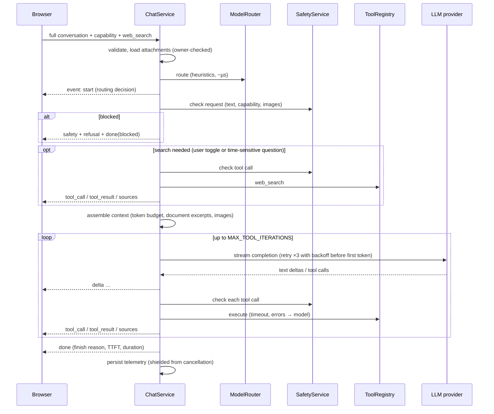

# Architecture

Nexa is a three-tier web application optimised for **first-token latency**.

```mermaid
flowchart LR
  subgraph Browser
    UI[React SPA<br/>Zustand store] --- LS[(localStorage<br/>conversations, settings)]
  end
  UI -- "same-origin /api/v1 (JSON + SSE)" --> EDGE[nginx (compose)<br/>or FastAPI static (cloud)]
  EDGE --> API[FastAPI backend]
  API --> DB[(PostgreSQL / SQLite<br/>uploads · feedback · telemetry)]
  API --> LLM[OpenAI-compatible endpoint<br/>open-source models: Groq / OpenRouter / vLLM]
  API --> WEB[Web search<br/>DuckDuckGo / Tavily]
```

| Layer | Technology | Role |
|---|---|---|
| Frontend | React 19, TypeScript, Vite, Zustand, react-markdown + highlight.js | Chat UI, local conversation history, streaming renderer, settings/theming. All HTTP goes through `src/api/client.ts`, typed by types generated from `openapi.yaml`. |
| Backend | Python 3.12, FastAPI, Pydantic v2, httpx, OpenAI SDK | Request pipeline: validation → routing → safety → tools → model → SSE streaming; uploads; feedback; metrics. |
| Database | SQLAlchemy 2 (async) + Alembic; SQLite for dev/tests, PostgreSQL for compose/CI/production | Uploaded-file text and images (24 h retention), 👍/👎 feedback, content-free request telemetry. See [database.md](database.md). |
| AI models | Any OpenAI-compatible host of open-source models | Capabilities map to configurable model ids: Fast (`llama-3.3-70b-versatile`), Reasoning (`openai/gpt-oss-120b`), Vision (`llama-4-scout`). A deterministic **mock provider** powers tests and offline demos. |
| Containers | Docker multi-stage builds, Docker Compose, nginx-unprivileged | `docker compose up` runs db + backend + frontend; the root `Dockerfile` builds a single production image. |
| CI/CD | GitHub Actions → Render | Lint, types, unit, integration (Postgres), contract, frontend, e2e (compose + Playwright), image build, security scans → deploy hook → smoke test. See [deployment.md](deployment.md). |

## Request pipeline (`POST /api/v1/chat/stream`)



Stopping generation = the browser aborts the fetch; the server sees the disconnect, cancels
the model stream and records `status=stopped`.

## Model routing (`app/services/router.py`)

Routing is a pure function of the request — no extra model call — so it costs microseconds.

| Signal | Capability |
|---|---|
| Image attached to the latest message | **Vision** (overrides a manual Fast/Reasoning choice, with the reason shown) |
| Short follow-up referring to an earlier image | Vision |
| ≥ 2 reasoning signals (step by step, prove, compare, algorithm, debug, stack trace, long input, large code block…) | **Reasoning** |
| Code or programming vocabulary | Fast ("coding request") |
| Anything else | **Fast** |
| User picked Fast/Reasoning/Vision | that capability (`mode: manual`) |

**Search detection**: the user's Search toggle, or time-sensitive wording ("latest", "today",
"news", "price", "who won", the current year…). Questions about an attached file never
trigger search. The model can also call `web_search` itself for follow-up searches.

## Tools (`app/services/tools/`)

| Tool | Purpose | Guardrails |
|---|---|---|
| `web_search` | DuckDuckGo (no key) or Tavily; numbered sources for `[n]` citations | query length cap, safety check (doxxing/prohibited), results fenced as untrusted |
| `calculator` | exact arithmetic via a whitelisted AST evaluator | no names/attributes, exponent & factorial caps, 2 s timeout |
| `unit_convert` | length, mass, volume, area, time, speed, data, energy, pressure, power, temperature | category checks |
| `datetime` | now in a timezone, timezone conversion, differences, offsets, weekday | IANA zones only |
| `data_process` | describe / sort / filter / aggregate / convert small CSV or JSON datasets | 200 kB, 10 k rows |

Tool failures become tool results the model can explain; they never break the stream.

## Safety (`app/services/safety.py`)

Integrated into the pipeline, context-aware:

* **Request** — clearly harmful requests (sexual content involving minors, mass-casualty
  weapons, malware creation) are blocked *before* the model is called. Sensitive-but-legitimate
  topics get **guidance**: self-harm (supportive notice to the user + instructions to the model),
  prompt-injection attempts, face identification (only when images are attached), locating
  private individuals.
* **Tool calls** — every model-requested tool call is re-checked (e.g. web searches for a
  private person's home address are blocked).
* **Untrusted content** — documents and search results are fenced and labelled as data.
* **Optional guard model** — set `SAFETY_MODEL` (e.g. Llama Guard) for a second opinion; it
  fails open because the heuristic layer has already run.

## Long context (`app/services/context.py`)

The browser sends the whole conversation each turn. The context builder walks from newest to
oldest within `CONTEXT_MAX_TOKENS`, giving the latest message 70 % of the remaining budget for
its attachments. Long documents are reduced to the chunks most relevant to the question
(keyword scoring) or evenly spread chunks for summaries, rather than truncated. When old turns
are dropped the model is told so. Multiple files are wrapped separately and the model is
instructed to analyse them independently (cross-file reasoning is out of MVP scope).

## Errors and retries

`attempt → retry → retry → retry → error` (`LLM_MAX_RETRIES=3`, exponential backoff with
jitter). Retries are transparent only before the first token; afterwards the user sees a
friendly error with **Retry**. Provider errors are mapped to codes (`upstream_unavailable`,
`upstream_rate_limited`, `upstream_misconfigured`, `upstream_bad_request`) that drive both
the user message and the ops runbook. Database outages return a handled 503 while chat keeps
working (telemetry is best-effort).

## Performance design

* Heuristic routing, no classifier round-trip; search pre-fetched in parallel with nothing
  else blocking; tools time-boxed.
* Token deltas streamed over SSE with proxy buffering disabled; the frontend batches deltas
  every 32 ms to keep rendering cheap; the markdown renderer is code-split.
* Images downscaled to ≤1568 px server-side (smaller payloads to the vision model).
* Measured platform overhead (mock model, full stack via nginx + Postgres): TTFT p50 ≈ 19 ms,
  p95 ≈ 21 ms — see `ops/benchmarks/` and `ops/slo.md`.

## Extension points (future, not MVP)

| Future capability | Where it plugs in |
|---|---|
| User accounts | `X-Client-Id` is the anonymous identity on every stateful endpoint; a `users` table can own client ids; `get_client_id` dependency becomes auth-aware. |
| Cloud sync | `ConversationRepository` interface in `frontend/src/storage/` — add a server-backed implementation. |
| Persistent memory | `ContextBuilder.build` accepts extra system guidance; a memory service can inject it. |
| More models | `Settings.model_*`, `LLMProvider` protocol, `RouteDecision`. |
| More tools / code execution / integrations | `ToolRegistry` + `SafetyService.check_tool_call`. Skill: `add-assistant-tool`. |
| Voice, image generation | New capability ids in the contract; provider protocol is modality-agnostic. |
| Mobile apps | Same OpenAPI contract and SSE protocol. |
